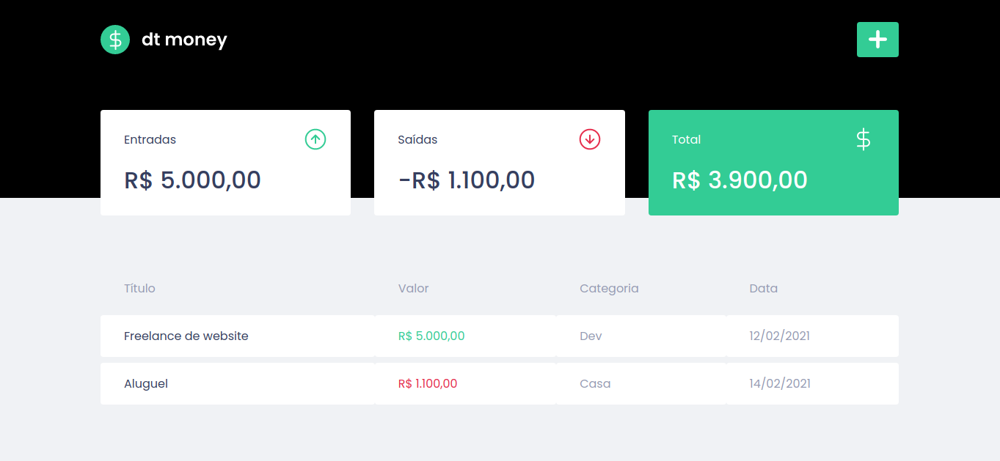

<h1 align="center">dtmoney</h1>
<p>Gerenciador de finanças</p>

<p>
 <a href="###tecnologias">Tecnologias</a> • 
 <a href="###instalacao">Instalação</a> • 
</p>

<h4 align="center"> 
	🚧  aplicação somente com frontend... api com miragejs  🚧
</h4>

<h1 align="center">
  
</h1>

<h1 align="center">
  
</h1>

### 🛠 Tecnologias

As seguintes ferramentas foram usadas na construção do projeto:

- [React](https://pt-br.reactjs.org/)
- [TypeScript](https://www.typescriptlang.org/)
- [Styled-Components](https://styled-components.com/)
- [MirageJS](https://miragejs.com/)
- [Polished](https://polished.js.org/)

### Instalação

```bash
# Clone este repositório
$ git clone <https://github.com/renatotrajano/dtmoney>

# Acesse a pasta do projeto no terminal/cmd
$ cd dtmoney

# Instale as dependências
$ yarn

# Execute a aplicação em modo de desenvolvimento
$ yarn start

```


